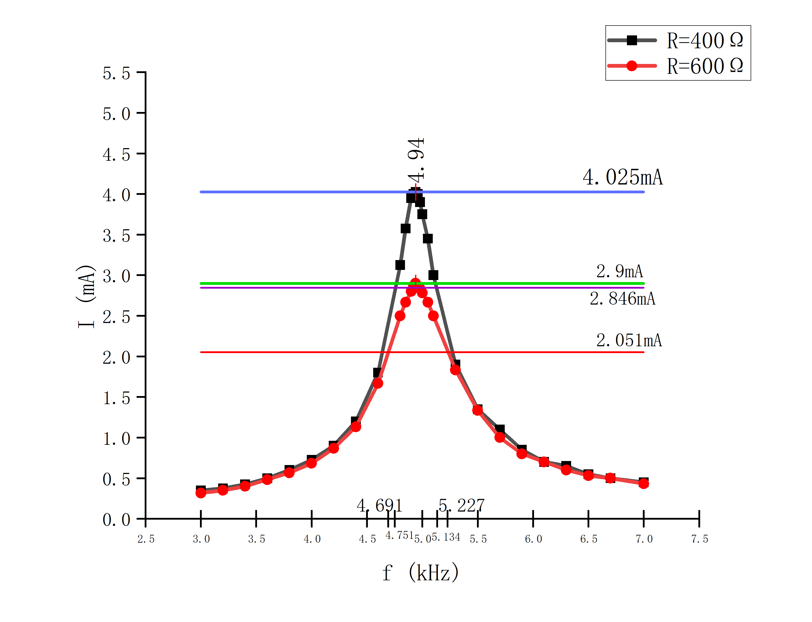

**交流谐振电路**

姓名：**王昱**
学号：**PB21030814**

* **实验数据处理**

**①RLC串联电路的谐振频率**

$n $| 1 | 2 | 3 | 4 | 5
:-: | :-: | :-: | :-: | :-: | :-:
$f_0/kHz$|$4.940$|$4.938$|$4.939$|$4.940$|$4.941$
**由此算得$f_0=4.940kHz$**
**②RLC串联谐振电路的幅频特性曲线**

**$R=400\Omega$ $V_{ipp}=1.80V$时的数据：**

$f/kHz $| 3.000 | 3.200 | 3.400 | 3.600 | 3.800
:-: | :-: | :-: | :-: | :-: | :-:
$V_{Rpp}/V$|$0.14$|$0.15$|$0.17$|$0.20$|$0.24$
$f/kHz $| 4.000 | 4.200 | 4.400 | 4.600 | 4.800
$V_{Rpp}/V$|$0.29$|$0.36$|$0.48$|$0.72$|$1.25$
$f/kHz $| 4.850 | 4.900 | 4.920 | 4.940 | 4.960
$V_{Rpp}/V$|$1.43$|$1.58$|$1.60$|$1.61$|$1.60$
$f/kHz $| 4.980 | 5.000 | 5.050 | 5.100 | 5.300
$V_{Rpp}/V$|$1.56$|$1.50$|$1.38$|$1.20$|$0.76$
$f/kHz $| 5.500 | 5.700 | 5.900 | 6.100 | 6.300
$V_{Rpp}/V$|$0.54$|$0.44$|$0.34$|$0.28$|$0.26$
$f/kHz $| 6.500 | 6.700 | 7.000 
$V_{Rpp}/V$|$0.22$|$0.20$|$0.18$

**$R=600\Omega$ $V_{ipp}=1.80V$时的数据：**
$f/kHz $| 3.000 | 3.200 | 3.400 | 3.600 | 3.800
:-: | :-: | :-: | :-: | :-: | :-:
$V_{Rpp}/V$|$0.19$|$0.21$|$0.24$|$0.29$|$0.34$
$f/kHz $| 4.000 | 4.200 | 4.400 | 4.600 | 4.800
$V_{Rpp}/V$|$0.41$|$0.52$|$0.68$|$1.00$|$1.50$
$f/kHz $| 4.850 | 4.900 | 4.920 | 4.940 | 4.960
$V_{Rpp}/V$|$1.60$|$1.68$|$1.72$|$1.74$|$1.72$
$f/kHz $| 4.980 | 5.000 | 5.050 | 5.100 | 5.300
$V_{Rpp}/V$|$1.70$|$1.67$|$1.60$|$1.50$|$1.10$
$f/kHz $| 5.500 | 5.700 | 5.900 | 6.100 | 6.300
$V_{Rpp}/V$|$0.80$|$0.60$|$0.48$|$0.42$|$0.36$
$f/kHz $| 6.500 | 6.700 | 7.000
$V_{Rpp}/V$|$0.32$|$0.30$|$0.26$

**算得$R=400\Omega$时$I$随频率的变化：**
$f/kHz $| 3.000 | 3.200 | 3.400 | 3.600 | 3.800
:-: | :-: | :-: | :-: | :-: | :-:
$I/mA$|$0.35$|$0.375$|$0.425$|$0.5$|$0.6$
$f/kHz $| 4.000 | 4.200 | 4.400 | 4.600 | 4.800
$I/mA$|$0.725$|$0.9$|$1.2$|$1.8$|$3.125$
$f/kHz $| 4.850 | 4.900 | 4.920 | 4.940 | 4.960
$I/mA$|$3.575$|$3.95$|$4$|$4.025$|$4$
$f/kHz $| 4.980 | 5.000 | 5.050 | 5.100 | 5.300
$I/mA$|$3.9$|$3.75$|$3.45$|$3$|$1.9$
$f/kHz $| 5.500 | 5.700 | 5.900 | 6.100 | 6.300
$I/mA$|$1.35$|$1.1$|$0.85$|$0.7$|$0.65$
$f/kHz $| 6.500 | 6.700 | 7.000
$I/mA$|$0.55$|$0.5$|$0.45$

**算得$R=600\Omega$时$I$随频率的变化：**
$f/kHz $| 3.000 | 3.200 | 3.400 | 3.600 | 3.800
:-: | :-: | :-: | :-: | :-: | :-:
$I/mA$|$0.317$|$0.35$|$0.4$|$0.483$|$0.567$
$f/kHz $| 4.000 | 4.200 | 4.400 | 4.600 | 4.800
$I/mA$|$0.683$|$0.867$|$1.133$|$1.667$|$2.5$
$f/kHz $| 4.850 | 4.900 | 4.920 | 4.940 | 4.960
$I/mA$|$2.667$|$2.8$|$2.867$|$2.9$|$2.867$
$f/kHz $| 4.980 | 5.000 | 5.050 | 5.100 | 5.300
$I/mA$|$2.833$|$2.783$|$2.667$|$2.5$|$1.833$
$f/kHz $| 5.500 | 5.700 | 5.900 | 6.100 | 6.300
$I/mA$|$1.333$|$1$|$0.8$|$0.7$|$0.6$
$f/kHz $| 6.500 | 6.700 | 7.000
$I/mA$|$0.533$|$0.5$|$0.433$

**利用ORIGIN作图如下**

###
**$R=400\Omega$时**，**$I_{max}=4.025mA$,$I=\frac{I_{max}}{\sqrt{2}}=2.846mA$。
在曲线上作出$I=2.846mA$直线之后读取横坐标为$4.751kHz、5.134kHz$。**
**则通频带宽度$\Delta f=(5.134-4.751)kHz=383Hz$**
**从图中读取到谐振频率$f_0=4.94kHz$,而理论值$f_0=\frac{1}{2\pi\sqrt{LC}}=\frac{1}{2\times3.14\times\sqrt{0.2\times5\times10^{-9}}}=5035Hz$。**

**由此得到相对误差$\mid\frac{5.035-4.94}{5.035}\mid\times100\%=1.89\%$**

###
**$R=600\Omega$时**，**$I_{max}=2.9mA$,$I=\frac{I_{max}}{\sqrt{2}}=2.051mA$。**
**在曲线上作出$I=2.051mA$直线之后读取横坐标为$4.691kHz、5.227kHz$**
**则通频带宽度$\Delta f=(5.227-4.691)kHz=536Hz$**
**从图中读取到谐振频率$f_0=4.94kHz$,而理论值$f_0=\frac{1}{2\pi\sqrt{LC}}=\frac{1}{2\times3.14\times\sqrt{0.2\times5\times10^{-9}}}=5035Hz$。**
**由此得到相对误差$\mid\frac{5.035-4.94}{5.035}\mid\times100\%=1.89\%$**
###
**③测量谐振状态时$V_{cpp}、V_{Lpp}$的值**
**$R=400\Omega,V_{Rppmax}=1.61V,V_{ipp}=1.80V$得到$V_{cpp}=21.0V,V_{Lpp}=22.0V$**
###
**$R=600\Omega,V_{Rppmax}=1.74V,V_{ipp}=1.80V$得到$V_{cpp}=16.4V,V_{Lpp}=16.5V$**
###
**④计算Q值**
**$R=400\Omega$时**
**$Q_1=\frac{\omega_0L}{R+R_L}=\frac{2\pi\times4940\times0.2}{400+80}=12.93$**
**$Q_2=\frac{1}{\omega_0(R+R_L)C}=\frac{1}{2\pi\times4940\times(400+80)\times5\times10^{-9}}=13.42$**
**$Q_3=\frac{V_L}{V_i}=\frac{22}{1.80}=12.22$**
**$Q_4=\frac{V_C}{V_i}=\frac{21}{1.8}=11.67$**
**$Q_5=\frac{f_0}{\Delta f}=\frac{4940}{383}=12.90$**
**$Q_6=\frac{1}{R+R_L}\sqrt{\frac{L}{C}}=\frac{1}{400+80}\sqrt{\frac{0.2}{5\times10^{-9}}}=13.18$**

$ i $| 1 | 2 | 3 | 4 | 5 | 6 |
:-: | :-: | :-: | :-: | :-: | :-: | :-: |
$Q_i$|$12.93$|$13.42$|$12.22$|$11.67$|$12.90$|$13.18$|
###

**$R=600\Omega$时**
**$Q_1=\frac{\omega_0L}{R+R_L}=\frac{2\pi\times4940\times0.2}{600+80}=9.13$**
**$Q_2=\frac{1}{\omega_0(R+R_L)C}=\frac{1}{2\pi\times4940\times(600+80)\times5\times10^{-9}}=9.48$**
**$Q_3=\frac{V_L}{V_i}=\frac{16.5}{1.80}=9.17$**
**$Q_4=\frac{V_C}{V_i}=\frac{16.4}{1.80}=9.11$**
**$Q_5=\frac{f_0}{\Delta f}=\frac{4940}{536}=9.22$**
**$Q_6=\frac{1}{R+R_L}\sqrt{\frac{L}{C}}=\frac{1}{600+80}\sqrt{\frac{0.2}{5\times10^{-9}}}=9.30$**

$ i $| 1 | 2 | 3 | 4 | 5 | 6 |
:-: | :-: | :-: | :-: | :-: | :-: | :-: |
$Q_i$|$9.13$|$9.48$|$9.17$|$9.11$|$9.22$|$9.30$|

* 分析可得到如下结论： **①$Q$表征了电路的储能效率，谐振时当$L、C$相等时，电阻大的电路$Q$低 ②$Q$表征了电路的选频特性，$R$小的电路$I$的峰值较大，通带窄，选频特性好**

###

* **误差分析**
**①测得的谐振频率比理论值低的原因：电路中存在分布电容、分布电感。电阻器接入电路的阻值均依靠密绕线圈实现，而密绕线圈在通交流电时会体现出明显的电感阻抗；同时，连接信号源及示波器的同轴线缆也会在交变电路中体现出电容特性。 ②品质系数$Q$的不同结果：$Q=\frac{\omega_0L}{R+R_L}$得到的结果是较为准确的，可信度高 ③示波器的测量精度不高，估读误差较大，导致实验数据误差较大**
  

