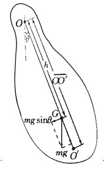
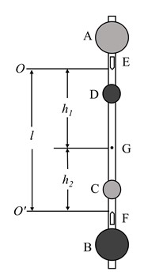

**凯特摆测重力加速度**

姓名：**王昱**
学号：**PB21030814**

**一.实验目的**

* 学习凯特摆的实验设计思想和技巧，掌握一种相比较而言精确的测量重力加速度的方法，熟练分析误差，计算不确定度等。

**二.实验原理**

* 刚体质量为$m$,转轴$O$到重心$G$的距离为$h$，绕$O$轴刚体的转动惯量为$I$，当地重力加速度为$g$，当它绕$O$轴转动时即为一复摆。当复摆离开平衡位置时，受到重力的分量$mgsinθ$作用而做周期性摆动，其运动方程为:
$$I \frac{d^2\theta}{dt^2}=-mghsin\theta\quad$$

* 当摆幅很小的时候，我们可以进行近似$sin\theta≈\theta,$则上式可化为：$$\frac{d^2\theta}{dt^2}=-\frac{mgh\theta}{I}=-\omega^2\theta$$
其中，$\omega=\sqrt{\frac{mgh}{I}}$是圆周率，又因为在简谐运动中$\omega=\frac{2\pi}{T}$,于是复摆的周期为：$$T=\frac{2\pi}{\omega}=2\pi\sqrt{\frac{I}{mgh}}$$
* 设复摆通过重心$G$的转动惯量为$I_G$，则根据平行轴定理：$$I=I_G+mh^2$$
代入上式得：$$T=2\pi\sqrt{\frac{I_G+mh^2}{mgh}}$$
故等效摆长$l$为$$\sqrt{\frac{I_G+mh^2}{mh}}$$
* 利用复摆的共轭特性，可精准地测量$l$。即在复摆重心两侧，并且和重心处于同一条直线上的两个点$O、 O'$,分别测量以$O、O'$为悬点(这里就是刀口)的摆动周期$T_1 、T_2$，当$T_1$和$T_2$相等(**通过调节四个摆锤的位置达到相等**)时，可以证明$OO'$(**刀口之间的距离**)就是等效摆长。即：$$T_1=2\pi\sqrt{\frac{I_G+mh_1^2}{mgh_1}}$$
$$T_2=2\pi\sqrt{\frac{I_G+mh_2^2}{mgh_2}}$$

* 调节至$T_1\approx T_2$时，$h_1+h_2\approx l$(等效摆长),消去$I_G$即可得：$$\frac{4\pi^2}{g}=\frac{T_1^2+T_2^2}{2l}+\frac{T_1^2-T_2^2}{2(h_1-h_2)}=a+b$$
当$h_1-h_2$足够大时，$b$项相对于$a$项影响很小。

* ==最终的计算公式为==：$$\frac{4\pi^2}{g}=\frac{T_1^2+T_2^2}{2l}+\frac{T_1^2-T_2^2}{2(2h_1-l)}$$

只需要测量$T_1、T_2、l、h_1$。
**三.实验过程**

* 测量两刀口之间的距离$l$,测三次取平均值，当作等效摆长。
* 将摆杆悬挂到支架上水平的V形刀承上，调节底座上的螺丝，使摆杆能在铅垂面内自由摆动，倒挂也如此。将光电探头放在摆杆下方，让摆针在摆动时经过光电探测器(**注意要将激光对准孔**)让摆杆作小角度摆动，待稳定后，按下reset钮，则测试仪开始自动记录一个周期的时间。调整四个摆锤的位置，使$T_1$和$T_2$逐渐靠近，差值小于$0.001s$后，测量正、倒摆动$10$个周期的时间$10T_1$和$10T_2$,各测$5$次取平均值。
* 将摆杆从刀承上取下,平放在刀口上使其平衡，平衡点即重心$G$找到重心$G$的位置后测出$\mid GO \mid$，即$h$三次，同样取平均值。

**四.数据处理**

$n $| 1 | 2 | 3
:-: | :-: | :-: | :-:
$l/mm$|$723.1$|$722.8$|$723.1$ 

$n $| 1 | 2 | 3 | 4 | 5
:-: | :-: | :-: | :-: | :-: | :-:
$10T_1/s$|$17.3365$|$17.3360$|$17.3363$|$17.3368$|$17.3369$
$10T_2/s$|$17.3362$|$17.3361$|$17.3366$|$17.3363$|$17.3363$

$n $| 1 | 2 | 3
:-: | :-: | :-: | :-:
$h_1/mm$|$423.0$|$423.2$|$422.8$

* $l$的平均值:$$\overline{l}=\frac{723.1+722.8+723.1}{3}=723.0mm$$
$l$的$A$类不确定度：$$u_A(l)=\sqrt{\frac{\sum_{i=1} ^3 (l_i-\overline{l})^2}{3\times(3-1)}}=0.10mm$$
卷尺的$\Delta_仪=0.8mm,t_{0.95}=4.30,k_p=1.96,C=3$根据：$$U_{0.95}=\sqrt{(t_{0.95}u_A)^2+(k_p\Delta_仪/C)^2}$$
$$U_{0.95}=\sqrt{(4.30\times0.10)^2+(1.96\times0.8/3)^2}=0.7mm$$
$$\therefore l=(723.0\pm0.7)mm…………(P=0.95)$$

* $h_1$的平均值：$$\overline{h_1}=\frac{423.0+423.2+422.8}{3}=423.0mm$$
$h_1$的$A$类不确定度：$$u_A(h)=\sqrt{\frac{\sum_{i=1} ^3 (h_i-\overline{h})^2}{3\times(3-1)}}=0.12mm$$
卷尺的$\Delta_仪=0.8mm,t_{0.95}=4.30,k_p=1.96,C=3$。根据：$$U_{0.95}=\sqrt{(t_{0.95}u_A)^2+(k_p\Delta_仪/C)^2}$$
$$U_{0.95}=\sqrt{(4.30\times0.12)^2+(1.96\times0.8/3)^2}=0.7mm$$
$$\therefore h_1=(423.0\pm0.7)mm…………(P=0.95)$$

* $T_1$的平均值：$$\overline{T_1}=\frac{17.3365+17.3360+17.3363+17.3368+17.3369}{5\times10}=1.73365s$$
$T_1$的$A$类不确定度：$$u_A(T_1)=\sqrt{\frac{\sum_{i=1} ^5 (T_{1i}-\overline{T_1})^2}{5\times(5-1)}}=1.6\times10^{-5}s$$
$\Delta_仪=0,t_{0.95}=4.30$
根据：$$U_{0.95}={t_{0.95}u_A}$$
$$U_{0.95}={4.30\times1.6\times10^{-5}}=7\times10^{-5}s$$
$$\therefore T_1=(1.73365\pm0.00007)s…………(P=0.95)$$

* $T_2$的平均值：$$\overline{T_2}=\frac{17.3362+17.3361+17.3366+17.3363+17.3363}{5\times10}=1.73363s$$
$T_2$的$A$类不确定度：$$u_A(T_2)=\sqrt{\frac{\sum_{i=1} ^5 (T_{2i}-\overline{T_2})^2}{5\times(5-1)}}=8\times10^{-6}s$$
$\Delta_仪=0,t_{0.95}=4.30$
根据：$$U_{0.95}={t_{0.95}u_A}$$
$$U_{0.95}={4.30\times8\times10^{-6}}=3\times10^{-5}s$$
$$\therefore T_1=(1.73363\pm0.00003)s…………(P=0.95)$$

* 计算$g$及其不确定度
已知：$$\frac{4\pi^2}{g}=\frac{T_1^2+T_2^2}{2l}+\frac{T_1^2-T_2^2}{2(2h_1-l)}=a+b$$
由$a=\frac{T_1^2+T_2^2}{2l}$可得$$a=\frac{1.73365^2+1.73363^2}{2\times0.7230}=4.157m^{-1}s^2$$
两边取对数$$\ln a=\ln (T_1^2+T_2^2)-\ln l-\ln 2$$
求微分$$\frac{1}{a}{\rm d}a=\frac{2T_1}{T_1^2+T_2^2}{\rm d}T_1+\frac{2T_2}{T_1^2+T_2^2}{\rm d}T_2-\frac{1}{l}{\rm d}l$$
所以不确定度公式为$$U_a=a\sqrt{(\frac{2T_1U_{T_1}}{T_1^2+T_2^2})^2+(\frac{2T_2U_{T_2}}{T_1^2+T_2^2})^2+(\frac{U_l}{l})^2}$$
代入数值求得$$U_a=0.004m^{-1}s^2$$
所以
$$a=(4.157\pm0.004)m^{-1}s^2…………(P=0.95)$$
考虑修正项$b$：
$$b=\frac{T_1^2-T_2^2}{2(2h_1-l)}=0.0003m^{-1}s^2$$
由于$b$的大小与$a$相比可以忽略不计，从而$$\frac{4\pi^2}{g}=\frac{T_1^2+T_2^2}{2l}=a$$求得$$g=\frac{4\pi^2}{a}=\frac{4\pi^2}{4.157}=9.4969m/s^2$$
对$g$的不确定性公式两边取对数:$$\ln g=\ln (4\pi^2)-\ln a$$
求微分：$$\frac{1}{g}{\rm d}g=-\frac{1}{a}{\rm d}a$$
最终得到不确定度计算公式为：$$U_g=\frac{g}{a}U_a$$
故$g$的不确定度为:$$U_{0.95}(g)=\frac{9.4969}{4.157}\times0.004=0.009m/s^2$$
$$\therefore g=(9.497\pm0.009)m/s^2…………(P=0.95)$$
* 求$g$(考虑修正项$b$)

$$g=\frac{4\pi^2}{a+b}=9.4962m/s^2$$
可见该值与不考虑修正项的$g$值相差不大。

**五.思考题**

* 凯特摆测量重力加速度，在实验设计上有什么特点？避免了什么量的测量？降低了哪个量测量精度？实验室如何来实现？
**答： ①凯特摆巧妙地运用了共轭点，避免和减少了某些不易测准的物理量对实验结果的影响，提高了实验的精度 ②避免测量重心$G$到转轴$O$的距离、绕$O$轴转动惯量。而是测量$l、T_1、T_2$,利用复摆的两点共轭性求得等效摆长$l$，利用数字测试仪精准测量$T_1、T_2。$ ③降低了周期$T$的测量精度。 ④在实验过程中，当两刀口位置确定后，通过调节$A、B、C、D$四摆锤的位置使得正、倒悬挂时的摆动周期$T_1、T_2$基本相等。**
* 结合误差计算，影响凯特摆测量精度的主要因素是什么？将所得的实验结果与当地的重力加速度的公认值比较，有无偏差？为什么？
**答：由于$T_1、T_2$的精度较高，所以影响凯特摆测量精度的主要原因是等效摆长$l$，也即两刀口之间的距离。该实验利用米尺测量等效摆长$l$，米尺的精度不高，产生的误差较大。**
#

* **下面分析误差**

该实验产生的误差较大，测出的$g$与实际的$g$差距很大。查表知合肥市的$g$大约是$9.7947m/s^2$
$$|\frac{9.4969-9.7947}{9.7947}|\times100\%=3.04\%$$
原因如下：** ①测量得到的$g$值偏小，可能是对$l$的测量出现了较大的误差。由于米尺的误差较大，测量时可能没有读准确导致了等效摆长$l$偏小。 ②测得的$g$值偏小，还有一种可能是周期$T$的测量出现问题。在实验过程中有可能没有控制好摆角的大小，使得摆动的幅度大于最大的幅度值；在实验过程中我还发现，凯特摆在摆动过程中可能并不是严格在同一平面上的，形成锥面摆，凯特摆在摆动过程中有轻微的晃动。 ③有可能没有调整好光电门与凯特摆下端的相对位置，造成误差。 ④支架底座没有调平造成误差。**

**六.实验总结**

* 通过本次实验，掌握了测量重力加速度$g$的另一种方法,同时复习了复摆的相关知识。
* 再一次熟悉了不确定度分析的相关方法。
* 虽然实验的准确度不高，但是通过本次实验第一次使用markdown语言写实验报告的电子版，收获颇多。

