# CH1(计算机系统概论)

## 冯诺依曼结构vs哈佛结构

* 冯诺依曼结构
  * 五大组成部件，运算器为中心
  * **数据指令同等地位，存储在存储器中**，按地址访问
  * 指令由**操作码、地址码**组成，在存储器顺序存放

* 哈佛结构
  * **将数据、指令分开存储**

> **现代计算机以存储器为中心**

## 计算机组成vs计算机体系结构

> 计算机组成**着重于计算机体系结构的逻辑实现、物理机器内部各事物的排序方式和控制方式、各部件的功能及相互的联系**

> 计算机体系结构**是程序员可见的机器属性**

* `e.g.`
  * 计算机有哪些指令，这属于计算机体系结构的问题
  * 计算机指令如何实现，这属于计算机组成的问题

## 硬件指标

* **机器字长**	
  
  * CPU一次能处理的二进制数据的位数
* **存储容量**
  
  * 存储器中所有存储单元的**总位数**，等于**存储单元的个数**$\times$**存储字长**
  
* **数据通路宽度**

  * 数据总线一次能并行传送的信息位数

  > 内部数据总线宽度等于机器字长
  >
  > 外部数据总线宽度等于系统数据总线的位数，即**数据字长**

  >  **机器字长vs存储字长vs数据字长**

* **运算速度**
  * 常用`benchmark`进行测试

  * 三个基本参数

    * **CPI(cycle per instruction)**=$\frac{CPU时钟周期数}{指令条数}$

    * **MIPS(million instruction per second)**=$\frac{指令条数}{程序执行时间\times10^6}$

    * **MFLOPS(million floating point operation per second)**=$\frac{浮点操作次数}{程序执行时间\times10^6}$

  * 时间角度

    * **响应时间**：从时间开始到结束之间的时间

    > $\frac{响应时间_X}{响应时间_Y}=\frac{性能_Y}{性能_X}$

    * **吞吐率**：单位时间内完成的工作量

      

## 深入分析CPU性能

* `argument`:
  
  * `f`：时钟频率，单位通常是`MHz`
    
  * `CLK`：总时钟周期数
    
  * `IC`：程序执行过程中处理的指令数
  
  > 程序执行的CPU时间：$T_{CPU}=CLK/f$
  >
  > $CPI=CLK/IC$
  >
  > CPU性能公式：$T_{CPU}=CPI\times IC\times T_{CLK}$
  
* 

  

  * `e.g.`

  |        题目        |                    |
  | :----------------: | ------------------ |
  | 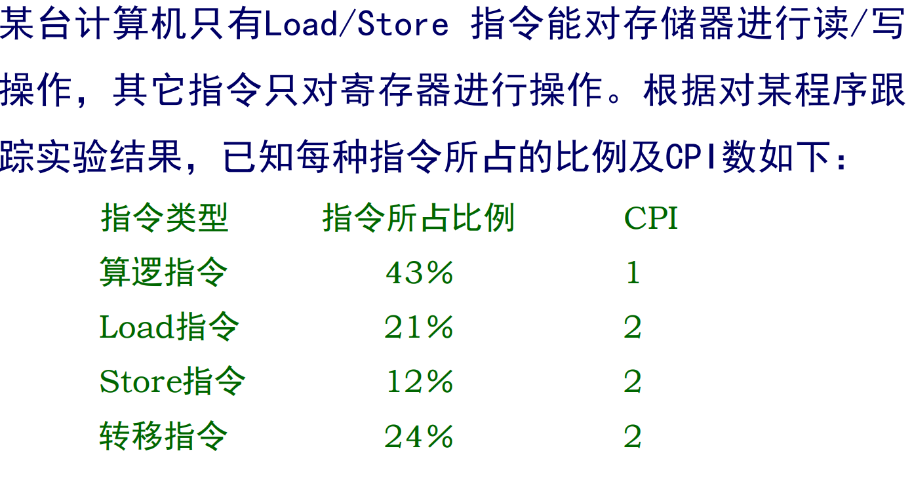 |  |

  

  > **注意此题，变化后的新比例加起来等于**$89\%$，**而不是**$100\%$

## Amdahl定律

> **实际上**$T_e=T_0-T_1+T_2$，**然后再根据**$f_e$、 $S_e$**的表达式得到加速比**

> **如果只针对整个任务的一部分进行优化，则加速比不超过**$\frac{1}{1-f_e}$

## 古斯塔夫森定律

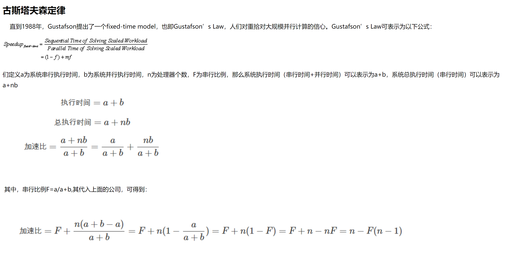

## 简答题

### 冯机架构中指令和数据都存储于存储器中，系统执行时如何区分

* **可以通过地址的来源进行区分 **

  * 如果地址是由PC提供的，那么系统取出的是指令

  * 如果地址是由指令的地址码提供的，那么取出的是数据 

  
  **同时，取指令阶段取出来的是指令，执行阶段取出的是数据**

# CH2(指令系统)

## 指令格式

* 通常由**操作码、地址码**组成

  * **操作码：指明要完成的操作特性和功能**

    * 分为**固定长度、可变长度**的操作码

      * 可变长度(扩展操作码技术)

      

      > 原则：**使用频度高的指令占用短的操作码**

  * **地址码(操作数)：指明操作数的存储位置**

    * 按地址个数分类指令

    

    > 三地址指令需要**四次访存**，两地址需要**三次或四次访存**，一地址需要**两次访存**

    * `e.g.`

    

* 指令字长

  * `def`：一个指令字中包含的二进制位数
  * 指令字长$=$机器字长则为**单字长指令**，指令字长$=$机器字长的一半则为**半字长指令**，指令字长$=$机器字长的两倍/多倍则为**双/多字长指令**
  * 指令系统所有指令字长度相等则为**等长指令结构**，否则为**变长指令结构**

## 数据存放方式

* 对数据的访问可以按**字节、半字、字、双字**进行

  

> **引发的问题：边界对齐、字节顺序**

  * **边界对齐问题**

    

> 不对齐可能导致读取一个数据需要**两次访存操作**
>
> 比如上例中，如果不对齐则B存放在3、4字节中，就需要两次访存

* **字节顺序问题**

  * **大尾端**
    * 低字节存在高地址
  * **小尾端**
    * 低字节存在低地址

  > `e.g.`：数据为`0x12345678`，左边是高字节右边是低字节
  >
  > 同时要注意**load、store**数据时可能要进行相对应的**符号扩展**

## 寻址方式

* 分为**指令寻址、数据寻址**

  * **指令寻址**

    * 分为**顺序寻址、跳跃寻址**

    > 顺序寻址：PC+1(+4……)自动形成下一条指令的地址
    >
    > 跳跃寻址：当前指令的地址码域给出下一条指令的地址

  * **数据寻址**

    * 形成数据的有效地址的方法，称为数据的寻址方式

    

    * 有效地址由**寻址特征、形式地址**共同确定
    * **寻址特征用于确定指令的操作数据使用何种寻址方式**

    |                  数据寻址方式                   |                                                 |
    | :---------------------------------------------: | ----------------------------------------------- |
    |  |  |

    > 一些说明：
    >
    > **偏移寻址**：根据所用寄存器是专用还是通用寄存器，分为隐式或显示两种。偏移寻址有三种形式
    >
    > 
    >
    > * **相对寻址**
    >   * 使用**PC提供基址**，指令字中的形式地址A给出**相对位移量**。即**EA=A+(PC)**
    > * **基址寻址**
    >   * 寄存器中含有一个主存地址，指令中的形式地址A表示相对偏移量
    >   * 程序执行时，寄存器内容不可变，形式地址A可变
    > * **变址寻址**
    >   * 指令中的形式地址A表示一个主存地址，寄存器含有相对偏移量
    >   * 程序执行时，寄存器内容可变，形式地址A不可变

## CISCvsRISC

* `CISC`(复杂指令集计算机)
  * 缺点：
    * 各种指令的使用频率相差悬殊
    * 指令系统的复杂性导致了计算机体系结构的复杂性
    * 不利于采用计算机体系结构技术(如流水技术)来提高性能
* `RISC`(精简指令集计算机)
  * 原则
    * 选取频率最高的指令
    * 指令功能尽量简单，在一个机器周期内完成
    * 指令长度相同
    * 只有`load、store`操作指令才访问存储器，其余指令操作都在寄存器之间进行

## RISC-V指令集

* **特点**

  * **内存按字节编址，采用小端模式，不要求字在内存中对齐**

  * 

  * **寻址模式**

  

* **其余RISC-V的相关资料见note useful info.pdf**

# CH3(CPU设计—单周期、多周期)

## 杂

* 寄存器堆在一个周期中**有两个读、一个写操作**，但是**不能同时完成读写操作**
* 

> **指令周期：取出并执行一条指令的时间**
>
> **机器周期：通常用从内存读取一条指令字的最短时间来定义**
>
> **时钟周期：要满足时间最长的操作(通常就是访存操作)，所以等于机器周期**
>
> 单周期CPU在一个周期内完成所有操作，多周期CPU在多个周期完成所有操作。所以结果如上图(原ppt有误)

## 单周期CPU

* **数据通路**(简易版)

* **R-type指令的执行**

  > 例如`add x1, x2, x3`，在一个周期内完成以下动作

  * `step1`：取指和PC+4
  * `step2`：读源操作数寄存器(这里是`x2 x3`)
  * `step3`：ALU操作
  * `step4`：结果写回目的寄存器(这里是`x1`)

* **lw指令的执行**

  > 例如`lw x1, offset(x2)`，在一个周期内完成以下动作

  * `step1`：取指和PC+4
  * `step2`：读源操作数寄存器(这里是`x2`)
  * `step3`：ALU操作完成**x2与符号扩展后的offset相加**
  * `step4`：ALU结果作为访存地址，送往数据MEM
  * `step5`：内存中的数据送往目的寄存器(这里是`x1`)

* **beq指令的执行**

  > 例如`beq x1, x2, offset`，在一个周期内完成以下动作

  * `step1`：取指和PC+4
  * `step2`：读源操作数寄存器(这里是`x1 x2`)
  * `step3`：ALU操作完成x1与x2相减，PC与被左移1位并进行符号扩展的offset相加，作为分支目标地址
  * `step4`：ALU的zero确定送往PC的值

  > **一些说明：**
  >
  > * 将offset左移一位是用来**表示半字为单位的偏移量**
  > * risc-v里应该是pc与offset相加，而不是pc+4与offset相加

* **jal指令的执行**

  * 需要增加一个jump信号，关键在于目的地址的生成

* **时钟周期由关键路径来确定**，单周期的实现通常还包括**定长单周期与不定长单周期**

## 多周期CPU

* **数据通路**(简易版)

* **五个阶段**

> **机器周期定长：机器周期=时钟周期**
>
> **指令周期不定长：可能为3、4、5个机器周期**
>
> **在一个指令周期内，PC不能变**

* `MIPS`**多周期参考**

* **多周期FSM**

## 思考题

* **寄存器堆先写、后写的优缺点**

|       思考题        |  |
| :-----------------: | ------------------- |
|  |  |

# CH4(CPU设计—流水线)

## 流水线的分类

## 流水线性能分析

* **吞吐率**

  * **吞吐率是指单位时间内流水线所完成的任务数/输出结果的数量**，通常有**最大吞吐率、实际吞吐率**

  * **最大吞吐率**$TP_{max}$**是指流水线稳定后所得到的吞吐率**

    * 假如流水线各段时间相等，均为$\Delta t_0$，则：$TP_{max}=1/\Delta t_0$

    * 假如流水线各段时间不等，第i段时间为$\Delta t_i$，则：$TP_{max}=1/max{\Delta t_i}$

      > 消除流水线瓶颈的方法：
      >
      > * **细分瓶颈段**
      > * **重复设置瓶颈段**
      >
      > 
      >
      > 通常来讲，细分瓶颈段优于重复设置瓶颈段。但是如果是原子操作，则必须重复设置瓶颈段

  * **实际吞吐率**$TP$**是指流水线由m(流水线深度)段组成完成n个任务的吞吐率**

    * 假如流水线各段时间相等，均为$\Delta t_0$，则：

      $T_{流水}=m\Delta t_0+(n-1)\times\Delta t_0$

      $TP=\frac{n}{T_{流水}}=\frac{1}{(1+\frac{m-1}{n})\Delta t_0}=\frac{TP_{max}}{1+\frac{m-1}{n}}$

    * 假如流水线各段时间不等，第i段为$\Delta t_i$，则：

      $T_{流水}=\Sigma_{i=1}^{m}\Delta t_i+(n-1)\Delta t_j$，其中$\Delta t_j=max{\Delta t_i}$

      $TP=\frac{n}{\Sigma_{i=1}^{m}\Delta t_i+(n-1)\Delta t_j}$

* **加速比**
  * **加速比是指流水线速度与等功能非流水线速度之比**
    * $S=\frac{T_{非流水}}{T_{流水}}=\frac{nm\Delta t_0}{m\Delta t_0+(n-1)\times\Delta t_0}=\frac{m}{1+\frac{m-1}{n}}$

* **效率**

  * **效率指流水线的设备利用率**，由于流水线有通过时间、排空时间，所以$E<1$

  

  * 假如各段时间相等，则各段的效率也相等。整个流水线的效率为$E=\frac{n\Delta t_0}{T_{流水}}=\frac{n}{m+n-1}=\frac{1}{1+\frac{m-1}{n}}$

  

  > 从时空图来看，**效率就是n个任务所占的时空区与m段总的时空区的比值**
  >
  > 由此可以算出流水线各段时间不相等时的效率：$E=\frac{n个任务占的时空区}{m个段总的时空区}$

* 三个参数的关系

  * $E=\frac{n\Delta t_0}{T_{流水}}=\frac{mn\Delta t_0}{T_{流水}m}=\frac{S}{m}$

  > 其中m是流水线深度，也就是最大加速比
  >
  > S是实际加速比
  >
  > **效率实际是实际加速比S与最大加速比m的比值**

  * $E=\frac{n\Delta t_0}{T_{流水}}=TP\times\Delta t_0$

  > **效率与实际吞吐率的关系**

## RISC-V五级流水线

|       MIPS各流水段操作        |                     |
| :---------------------------: | ------------------- |
|  | 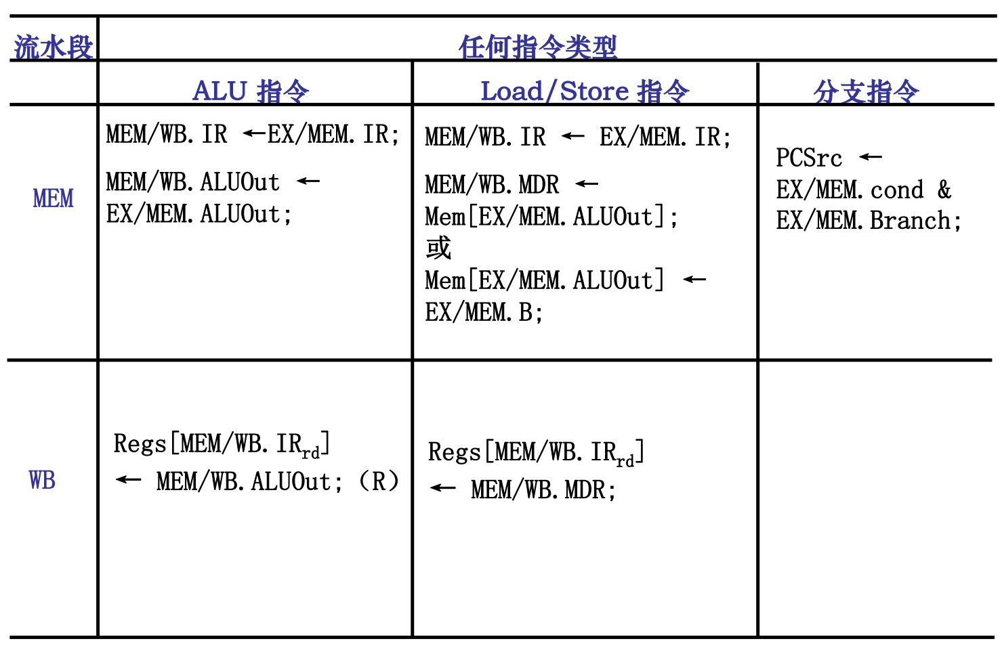 |

* **数据通路**(简易版)

* `MIPS`与`RISC-V`的区别(都讲risc-v了，ppt还一堆mips的图，没听过课的麻了)

  * 单周期

  

  * 流水线

  

> 区别：
>
> * **分支地址计算时PC的选择是PC还是PC+4**
> * 目标寄存器的编号、mux
> * 立即数的扩展与立即数的移位

* **相关**

  * 分为结构相关、数据相关、控制相关
  * **结构相关：硬件资源满足不了指令重叠执行的要求，发生资源冲突时产生结构相关**
    * 典型的结构相关由访存和寄存器造成，解决方式如下
      * **流水线stall一个周期**
      * **使用哈佛结构**

  * **数据相关：当一条指令需用到前面指令的执行结果，而这些指令在流水线中重叠执行时，会产生数据相关**

    * 数据相关的分类如下

      > 现假设有i、j两条指令，i指令在前，j指令在后

      * **RAW(写后读相关)**

      > 指令j在指令i写入寄存器前就读出寄存器内容

      > 消除**RAW的方法：数据定向技术(forwarding/bypassing 数据前递)**
      >
      > **forwarding解决不了的lw use问题：使用interlock(互锁)，向EX流水段插入bubble，flush ID/EX的段间寄存器并stall IF/ID和PC**

      > 一些**RAW(最后两张图用于解决lw use问题)**的例子：

      |  | 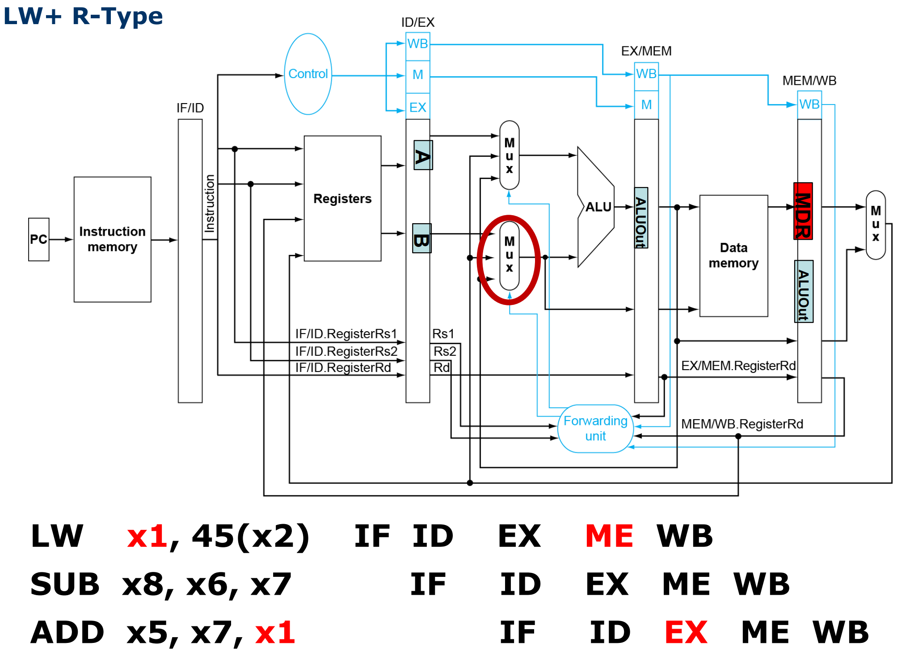 |
      | ------------------- | ------------------- |
      | 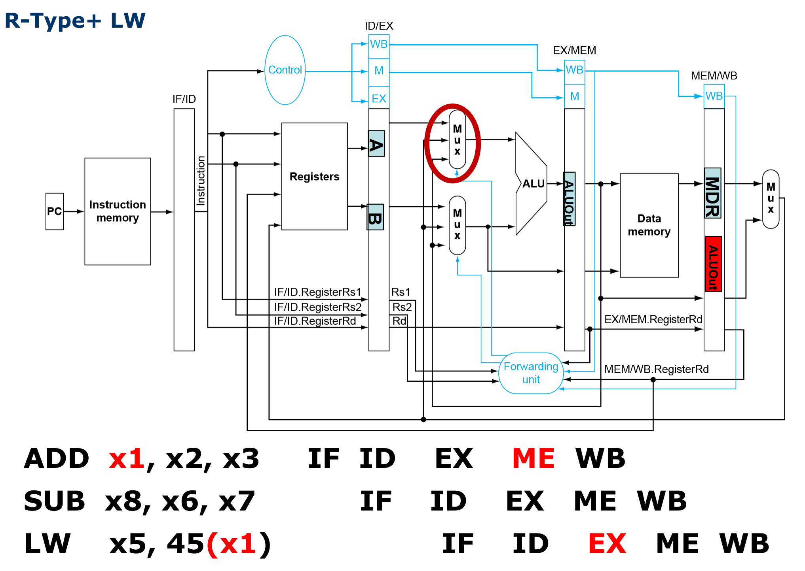 | 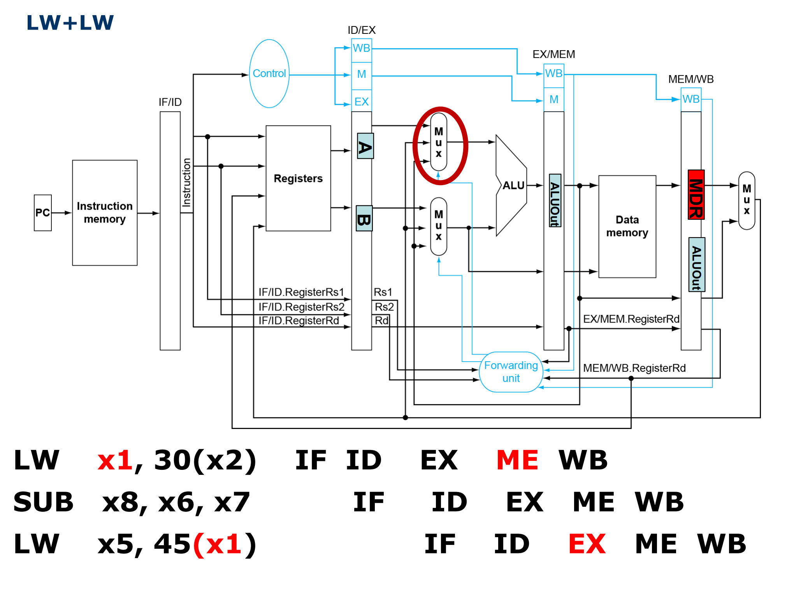 |
      |  | 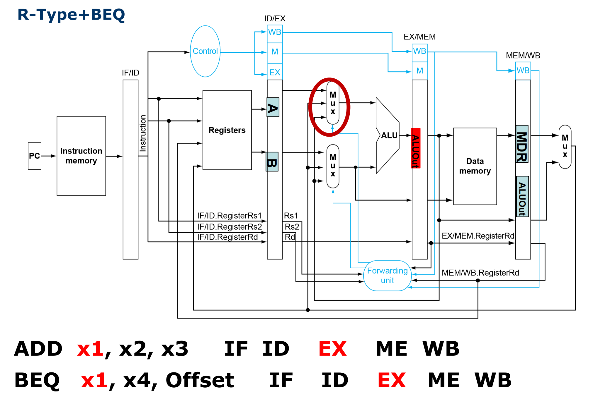 |
      |  |  |

      * **WAW(写后写相关)**

      > 指令j在指令i写入寄存器之前就写入寄存器

      * **WAR(读后写相关)**

      > 指令j在指令i读出寄存器之前就写入寄存器

    > 说明：**在按序流动的流水线中，只可能出现RAW相关。在非按序流动的流水线中，三种相关都可能发生**

  * **控制相关：流水线遇到分支指令和其他会改变PC的指令时，会发生控制相关**

    > 如果在EX级确定分支结果，需要flush IF/ID ID/EX两个段间寄存器，损失比较大。
    >
    > 分支优化技术/方法：
    >
    > * **ID级确定分支指令的结果**
    >
    >   * 这需要将目的地址加法器、寄存器比较器等部件移到ID级。如此分支延迟从2降为1
    >
    > * **延迟分支(delayed branch)**(感觉没啥用hhh)
    >
    >   * 延迟分支的来源：
    >
    >     * **从前调度**(使用分支前的指令填充)
    >
    >     
    >
    >     * **从目标处调度**(使用分支目标指令填充)
    >
    >     
    >
    >     * **从失败处调度**(使用分支不发生时的下一条指令填充)
    >
    >     
    >
    >   
    >
    > * **分支预测**
    >
    >   * 分为静态预测(投机执行)、动态预测(分支预测器)
    >
    >   * **静态预测三种策略：**
    >
    >     * 预测总是不发生转移
    >     * 预测总是发生转移
    >     * 对于向后的转移预测会发生，对于向前的转移预测不会发生
    >
    >   * **动态预测**
    >
    >     * 两位饱和计数器
    >
    >     
    >
    >   > 通过**数据预排序**，可以提升分支预测的有效性

  * **解决数据相关**`e.g.`

  

## 流水线多发射技术

* **超标量技术**
  * 每个时钟周期同时发射并执行多个操作
* **超流水线技术(superpipeline)**
  * 在一个clk内实现更细的流水段

* **超长指令字技术**
  * 将多条能并行的指令组合成一条具有多个操作码字段的超长指令

## 思考题

|  | 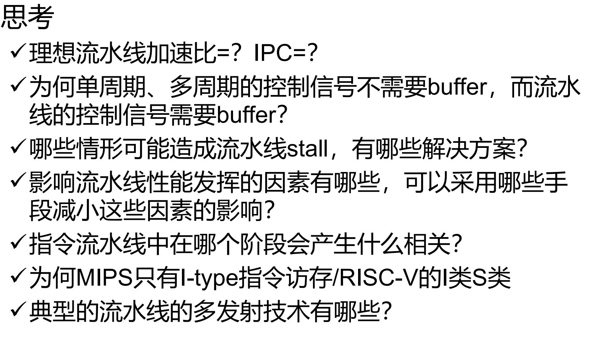 |
| ----------------------------------------------- | ------------------- |
| 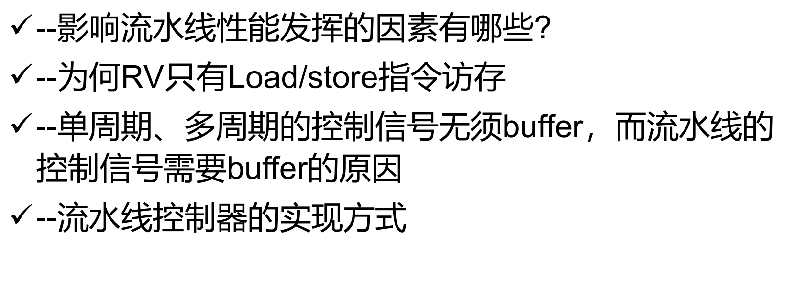                             |                     |

# CH5(中断与异常)

## 中断系统

* **中断/异常发生的时机**
  * I/O中断(**随时发生，延迟响应**)
    * 在指令周期结束后
  * 异常(**随时发生，随时处理**)
    * “马上”响应
  * 陷阱(**专用指令，特殊处理**)
    * “马上”响应

* **引起中断的因素**

  * 人为设置的中断
  * 程序异常
  * 硬件故障
  * I/O发起的中断请求
  * 外部事件(如键盘中断现行程序)

* **中断系统需解决的问题**

  * 中断源**如何向CPU提出请求**

    * 一个中断源对应一个**INTR(中断请求标记触发器)**，多个INTR组成**中断请求标记寄存器**

    

    > 当INTR位“1”时，表示中断源有请求

  * 如何处理中断源**同时提出请求**

    * **软件实现**

    

    * **硬件实现**

      * **分散在中断源接口电路的链式排队器**

      

      * **在CPU内部的排队器**

      

  * CPU**什么时间、什么条件、以什么方式**响应中断

    * **响应中断的条件**

      * 当**EINT(允许中断触发器)**为1，且有中断请求(**INTR(中断请求标记触发器)=1**)时，CPU可以响应中断

    * **响应中断的时间**

      * CPU在**指令执行周期**结束后，响应中断源的请求。原因是**CPU在执行周期结束时刻统一向所有中断源发出中断查询信号**

      

    * **以什么方式响应中断**

      * 中断周期完成的主要操作，是通过**中断隐指令(机器指令系统没有的指令，是CPU在中断周期内由硬件自动完成的一条指令)**

        * **保护程序断点**，也就是将当前PC保存到存储器/堆栈中
        * **寻找中断服务程序的入口地址**

        > **硬件向量法**：在中断周期内，将向量地址送至PC
        >
        > **软件查询法**：中断识别程序入口地址送至PC

        * **关中断**

        > `EINT`(允许中断触发器)为0，`INT`(中断标记触发器)为1

  * 如何保护现场

    * **保护程序断点**

      * 中断隐指令完成

    * **保护CPU内部各寄存器内容**

      * 中断服务程序ISR完成

      

  * 如何寻找**入口地址**

    * 分为**硬件向量法、软件查询法**

      * 硬件向量法

      

      * 软件查询法

      

  * 如何恢复现场，如何返回

    * 恢复现场是指**中断返回前，将寄存器内容恢复到中断处理前的状态**。由中断处理程序ISR完成

  * 如何处理**多重中断**

    

    * 实现**多重中断**的条件

      * 提前设置**“开中断”指令**

        

      * 优先级高的中断源有权中断优先级低的中断源

    * 屏蔽技术

      

      * 屏蔽寄存器的内容称为**屏蔽字**，可以改变**处理优先级**，不可改变**响应优先级**

    ​		

## RISC-V处理异常的方式

* **RISC-V处理异常的方法**

  * 保存导致**异常/中断**的指令的PC值
    * `RISC-V`使用`SEPC(supervisor exception program counter，管理员异常程序计数器)`

  * 保存问题的表征
    * `RISC-V`使用`SCAUSE(supervisor exception cause register，管理员异常原因寄存器)`

  * 跳转到处理程序
  * 向量化中断
  * 向量表基地址寄存器加上异常向量地址

* **带异常处理的数据通路**

* **流水线中的异常与中断**

  * 多个流水段，多条指令，多种异常并发
  * 遇到的挑战
    * **后续指令在产生异常指令完成之前已经改变了系统的部分状态**
    * **异常发生顺序与指令执行顺序不一定相同**
    * **转移指令、分支预测给异常处理带来麻烦**

  * **解决方法**

    * **非精确处理异常**

      * 方案一：允许已进入流水线中的指令执行完再转去执行中断处理
      * 方案二：将异常指令的后续指令排空

      > 缺点：
      >
      > * 异常响应时间长
      > * 程序调试不便
      > * 如果等进入流水线的指令执行完，可能会导致程序出错

    * **精确处理异常**

      * 要保证异常指令可重启：
        * 安全停止流水线，完整保存当前状态
        * 需要大量后援寄存器保存流水线的现场
      * **提交点技术**

## 思考题

|                     |                     |
| ------------------- | ------------------- |
| 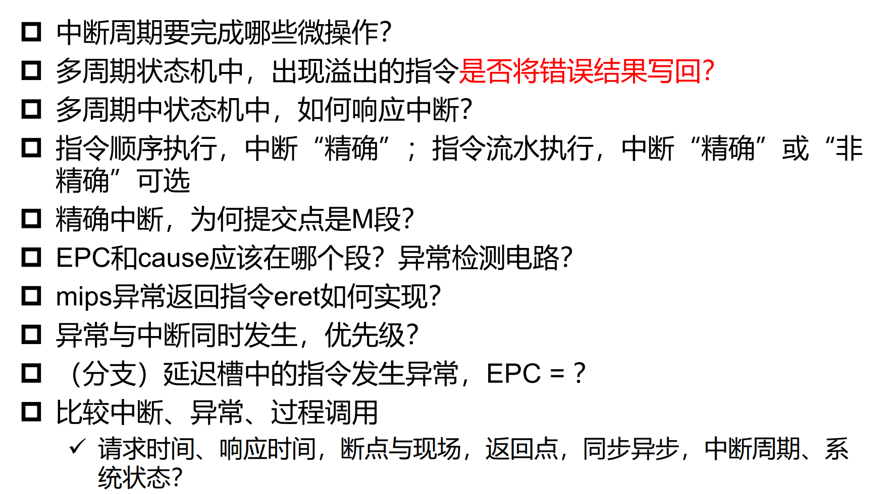 | 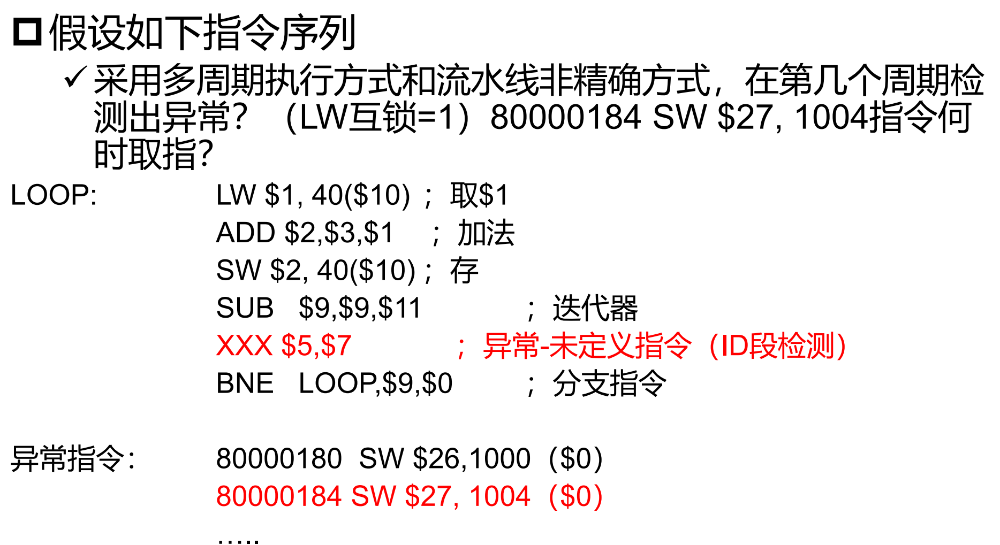 |

# CH6(存储系统)

## 存储器的结构层次

## 主存储器

### 主存储器性能指标

* **存储容量**
  * 一个存储器中的存储单元的总数
* **存取时间**
  * 存储器访问时间：一次读操作命令发出到该操作完成，将数据送至**数据总线**上经历的时间。写操作时间通常等于读操作时间
* **存储周期**
  * 连续两次读写操作所需的最小间隔时间
* **存储器带宽**
  * 单位时间内存储器存取的信息量
  * **提高存储器带宽的措施**
    * 缩短存取时间、存储周期
    * 增加存储字长
    * 增加存储体

### SRAM、DRAM

* **半导体存储芯片**

  * **连线**：存储芯片通过**地址总线、数据总线、控制总线**与外部相连

    * **地址线**：单向输入，位数与芯片存储单元数量有关
    * **数据线**：双向输入/输出，位数与芯片可一次读出/写入的数据位数有关
    * **控制线**
      * 读/写控制线
      * **片选线**：在存储矩阵中选择存储芯片

  * **译码驱动方式**

    * 分为线选法、重合法

      * **线选法**

      

      > 用一根字线直接选中一个存储单元的各位

      * **重合法**

      

      > 被选单元需要由X、Y两个方向的地址决定

* `SRAM`

  

  * **信号线**

    * 地址线$A_0-A_5$
    * 数据线$I/O_0-I/O_3$

    * 控制线$R/$ $\overline{W}$

  

  * 上图的`SRAM`采用重合法双译码，15条地址线，其中$A_0-A_7$是行地址译码，$A_8-A_{14}$是列地址译码。每个存储单元保存1bit，1byte数据保存在8块芯片的同一地址单元

* `DRAM`

  

  * 由于存储器访问随机，有些存储单元可能会长期得不到访问，这会导致存储单元内的原信息慢慢消失，因此需要进行**刷新**

    * **刷新的实质：将原存储信息读出，由刷新放大器形成原信息并重新写入**

    * 刷新方式

      * **集中刷新**：DRAM的所有行在每一个刷新周期都被刷新，此时需要停止读/写操作。不能进行读写操作的这段时间称为**死时间/访存死区**

      

      * **分散刷新**：对每行存储单元的刷新分散到每个存储周期内完成。$(存取周期)t_C=(读写/维持信息)t_M+(刷新)t_R$

      

      * **异步刷新**：结合集中刷新和分散刷新

      

### 存储器与CPU的连接

* **位扩展**

  * 增加存储字长

  

* **字扩展**

  * 增加存储单元的数量

  

* **字、位扩展**

  * 同时增加存储字长、存储单元的数量

* **存储器与CPU的连接**

  * 需要注意三种信号线的连接

    * **地址线**：CPU的地址线往往比存储芯片的地址线多。通常，**CPU的低地址线与存储芯片的地址线相连，高地址线用于存储扩展/用于片选**

    * **数据线**：CPU的数据线需要与存储芯片的数据线**数量相同，如果不同需要进行位扩展**

    * **控制线**：读/写命令线可以直接连接到存储芯片；**片选线的片选有效信号与CPU的访存控制信号**$\overline{MREQ}$**(低电平有效)有关，还与地址线有关**

  * `e.g.`见唐书$P_{95}-$

### 提高访存速度的措施

* **采用双端口存储器**

* **采用高速主存、新型存储部件**

* **并行访问存储器：采用交叉访问**

  * **单体多字系统**：多字是指在**一个存取周期**内，从同一地址开始顺序读出多条指令字，再逐条将指令送至CPU
    * 单体四字如下

  

  * **多体并行系统**(交叉存储器)：包括**高位交叉编址和低位交叉编址**

    * 高位交叉编址

    

    > 顺序编址、方便扩容

    * 低位交叉编址

    

    > 交叉编址、不方便扩容。可以并行访问、交叉访问(提高带宽)
    >
    > **两个连续地址字的读取之间不必插入等待状态**
    >
    > 又称为**模M(M是模块数)编址**

    * 两种编址方式连续读取n个字所需时间(这里存取周期是T，总线传输周期是t)
      * 高位交叉编址：$t_1=nT$
      * 低位交叉编址：$t_2=T+(n-1)t$

* **采用层次化存储系统结构**

### 容错与校验

* **编码纠错理论(简易版)**

  * **码距**：任意两个合法编码之间不同的二进制位数叫这两个码字的码距。任意两个码字的最小距离就是**编码系统的码距**
  * 在一个码组内为了检测D个误码，需要最小码距$L>=D+1$

  * 在一个码组内为了纠正C个误码，需要最小码距$L>=2C+1$

  * $L-1>=D+C$且$D>=C$
    * 说的是编码最小距离L越大，检测错误位数D也越大，纠正错误位数C也越大。纠错能力恒小于或等于检测能力

* **奇偶编码校验**

  * 在被传送的n位代码$(b_{n-1}b_{n-2}……b_1b_0)$上增加一位**校验位P**，将原数据和得到的奇(偶)校验位一起进行存取/传送

  * **奇校验**

    * 使得**1**的个数为奇数
    * `e.g.`：$0000 \space 0000 \rightarrow 0000\space0000 \space1$

  * **偶校验**

    * 使得**1**的个数为偶数

    * `e.g.`：$0000\space0000\rightarrow0000\space0000\space0$

* **海明码**

  * 常用于**纠错一位**的场合

  * 设有k位数据，r位校验位，则r位校验位有$2^r$种组合。用0表示无差错，剩余$2^r-1$个值表示有差错，并指出错在哪一位。**校验位应满足的不等式：**$2^r-1>=r+k$

  

  * **校验位的位置与取值**

    * 校验位排列在$2^{i-1}(i=1,2……)$位置上
    * 假设海明码为$H_mH_{m-1}……H_2H_1\space \space \space m=r+k$，$H_i$由多个校验位校验，需要分解位号，使之等于校验位的位号之和。

    > **校验位校验哪几位的问题可以参考这个blog：**[海明码](https://www.cnblogs.com/godoforange/p/12003676.html)

    ​		

    > 以4位数据为例，$P_1$参与校验$D_4、D_2、D_1$位，采用按偶校验的原则，$P_1$应使得$1、3、5、7$位**1**的个数为偶数，所以$P_1=D_4\bigoplus D_2\bigoplus D_1$。其余的类似

  * 海明码的**纠错原理**

    * 还是以4位数据为例，接收到海明码的数据中校验位分别设为$S_1、S_2、S_3$，则$S_1=P_1\bigoplus D_4 \bigoplus D_2 \bigoplus D_1$ 

      $S_2=P_2 \bigoplus D_4 \bigoplus D_3 \bigoplus D_1$

      $S_3=P_3 \bigoplus D_4 \bigoplus D_3 \bigoplus D_2$

      当有一个值不为零时，说明出错，将校验位排起来可以看出哪一位出错。如果传送的信息位出错则纠正，如果是校验位出错一般情况下不予纠正

* **循环冗余校验码(CRC)**

     * 基于**模2运算**
       * 模2加减：结果一样，相当于异或
         	* 模2乘：按照模2加去求部分积之和
         	* 模2除：**上商的原则为：当部分余数的首位为1时，上商1；当部分余数的首位为0时，上商0；当部分余数的位数小于除数位数时，该余数即为最终的余数**
* 假设有**n位数据，k位校验，k+1位生成多项式**，待编码的数据为$D_{n-1}D_{n-2}……D_1D_0$，用多项式表示成$M(x)=D_{n-1}x^{n-1}+D_{n-2}x^{n-2}+……+D_1x^1+D_0x^0$
  
    * 将$M(x)$左移$k$位(补0)，得到$M(x)\times x^k$和$D_{n-1+k}……D_{1+k}D_{0+k}000……0$(k个0)
    * 用$M(x)\times x^k$除以$k+1$位的生成多项式$G(x)$得到的余数便是$k$位校验位
  * 将余数拼接到数据位之后，称为$n+k$位的数据，也称为$(n+k,n)$码
  
* **CRC的译码和纠错**
  
    * 将收到的$n+k$位CRC编码用生成多项式$G(x)$去除
      
      * 如果正确，则余数位0
  * 如果错误，余数不为0，余数与出错位的关系取决于生成多项式$G(x)$
    
  * 用**循环移位法**纠错
  
      * 将CRC码进行**左循环移位(即将最高位放在最右边)**，直到出错位被移到最高位
        
        * 余数添一个0继续除生成多项式，直到余数等于出错位时，出错位被移到最高位
      * 对最高位取反(纠错)
      * 继续循环移位，直至循环一周
      
    * 余数继续除法，直至等于第一次的余数
    * `e.g.`
    
      

## Cache

* **Cache数据交换过程**
  * CPU将内存地址发给Cache和主存
  * 控制逻辑判断地址是否在Cache中
    * 命中，则Cache将存储字送给CPU(**按字传送**)
    * 未命中，则主存将存储字送给CPU，同时将该字所在的块调入Cache(**按块传送**)

* **Cache性能指标—命中率**
  * Cache命中率与**容量和块的大小**有关，Cache容量越大，命中率越高；随着块大小由小到大增长，命中率先提高后下降
  * $N_c$表示访问Cache完成存取的总次数，$N_m$表示访问主存完成存取的总次数
    * **命中率**$h=\frac{N_c}{N_c+N_m}$
  * $t_c$表示命中时的Cache访问时间，$t_m$表示未命中时的主存访问时间
    * **平均访问时间**$t_a=ht_c+(1-h)t_m$
  * $e$表示访问效率
    * **访问效率**$e=\frac{t_c}{t_a}\times100\%$

* **Cache的基本结构**
   

  * **地址映射**

    * 将主存的地址映射到cache中，有三种映射方式
    * **全相联映射**：主存中每个字块可以映射到Cache的任何一块位置上，利用**标记(tag)**来记录映射关系

    

    * **直接映射**：每个主存块只能映射到Cache的一个特定块位置，但是每个Cache块对应若干个主存块。用$i$表示Cache块号，$j$表示主存块号，$m$表示Cache总块数则有$i=j\space mod\space m$

    

    * **组相联映射**：是直接映射和全相联映射的折中，组间直接映射，组内全相联映射。将Cache块分为$u$组，每组有$v$块(称为**v路组相联**)，则有$Cache块数m=u\times v$。$组号q=j\space mod\space u$(**主存第j块内容映射到Cache的第q组中的某块**)

    

    * `e.g.`

    

  * **替换策略**

    * 直接映射不需要考虑替换算法，直接替换对应的块即可
    * 全相联、组相联映射需要考虑替换算法
    * **先进先出FIFO算法**：选择最早调入Cache的块替换
    * **随机法**：随机选择替换的块
    * **最少使用LFU算法**：被访问的块计数器加1，替换时选择值最小的块，同时清零计数器(缺点是**不能反映Cache近期的访问情况**)
    * **最近最少使用LRU算法**：被访问的块计数器置为0，其它块计数器加1，替换时选择值最大的块(也可以使用移位寄存器来实现这一算法)

  * **读写策略**

    

    * **存储一致性问题**：Cache块内写入的信息要与被映射的主存块内的信息完全一致

    * **Cache写策略(写命中)**

      * **写直达**：写操作时，数据既写入Cache又写入主存。这导致写操作时间**就是访问主存的时间**，优点是读操作时不涉及脏块的处理，更新策略实现容易
      * **写回法**：写操作时，数据只进Cache而不进主存，当被写过的Cache块要被替换时才写回主存。

    * **Cache写策略(写失效)**

      * **按写分配**：写失效时，把所写单元所在块调入Cache，再写入
      * **不按写分配**：写失效时，直接写入下一级存储器而不调块

      > **通常采取的组合：写回法+按写分配 or 写直达法+不按写分配**

  ​			

## 虚拟存储器

### 基本概念

* **虚地址**：也称为逻辑地址，指用户编程时用的地址
  * 产生虚地址是因为：程序所需的存储容量超过实际物理内存容量；多用户多任务系统中，多用户/多任务共享内存并行执行，每个程序占用的实际内存编程时无法确定，需运行时**动态分配**
  * 虚存空间的大小仅依赖于**辅存大小**
* **实地址**：也称为物理地址，指实际的物理主存的地址
  * 虚地址到实地址的转换称为**程序的重定位**

* **虚存与Cache的比较**
  * 相同点
    * 利用**程序的局部性原理**，提高存储系统的性价比
  * 不同点
    * **侧重点不同**
      * Cache主要解决主存与CPU速度差异
      * 虚存主要解决主存与辅存的存储容量
    * **数据通路不同**
      * Cache和主存与CPU之间均有**直接访问通路**，Cache未命中可以直接访问主存
      * 虚存依赖的辅存与CPU之间**没有直接数据通路**，主存未命中通过换页解决
    * **透明性不同**
      * Cache完全由硬件管理
      * 虚存由软件(os)和硬件共同管理
    * **未命中的代价不同**
      * Cache未命中的代价远小于主存未命中

### 虚存的分类及替换

* 虚存机制要解决的三个问题：**地址映射问题**、**替换问题**、**更新问题**

* 虚拟存储器的分类

  * **页式虚拟存储器**

    > 优点：页长固定，便于页表的构造和管理，不存在碎片
    >
    > 缺点：页长大小与程序逻辑大小无关，不利于编程的独立性，以及复杂的存储管理

    * 页式虚拟地址

      * 逻辑页：虚地址空间被分为等长大小的页
      * 虚地址：分为两个字段，高字段为逻辑页号，低字段为页内偏移
      * 物理页：主存空间被分成与逻辑页同样大小的页

      * 实地址：分为两个字段，高字段为物理页号，低字段为页内偏移

    * **页表**

      

      > 图为**根据虚拟地址索引页表获得物理地址**

      * **页表用于将虚地址转换成实地址**，每个进程对应一个页表，每个页表的一个表项对应一个逻辑页，表项的内容有**指示逻辑页是否调入主存的有效位和逻辑页对应的物理页号**

    * **页式虚拟地址映射**

      

      * **页表基址保存在页表基址寄存器，页表保存在主存中**。地址映射：**逻辑页号+页表基址**

    * **二级页表**

    

    * **反向页表**

    

    > 适用于**逻辑页少，物理页多**的情况。主存的物理页数目决定反向页表的长度。
    >
    > 缺点是反向查找的匹配时间很长，性能受限于查找算法

    * **快表TLB**

      

      * 出现原因：页表保存在主存中，需要访问两次主存才能完成访问操作(**第一次获得物理地址，第二次获得数据**)。为减少访存次数，对页表进行二级缓存。
      * 保存在主存中的完整页表称为**慢表**，专用于页表缓存的高速存储部件称为**快表TLB**

      * **TLB地址映射**

      

      * **完整的访存过程**

      

  * **段式虚拟存储器**

    > 优点：段有逻辑独立性；段长可以按需动态改变
    >
    > 缺点：主存空间分配复杂；容易在段间产生碎片

    * 段的虚地址组成：**段号+段内偏移量**
    * **段表**
      * 用于**虚地址到实地址转换**
      * 本身也是一个段，通常存于主存中。每个程序设置一个段表，每个表项对应一个段。表项包括**有效位、段起始地址、段长**
    * **段式虚拟地址映射**

    

  * **段页式虚拟存储器**

    * 物理主存被等分为页，程序按逻辑结构分段，每个段按主存的页大小分页
    * 程序**按页调入调出，按段编程、保护、共享**

    * 段页式虚地址

      

    * `e.g.`

    

* **虚存替换算法**

  * 替换时机：需从辅存调页而主存已满
  * 三种主要算法：
    * **FIFO算法**
    * **LRU算法**(最近最少使用)
    * **LFU算法**(最不经常使用)
  * `e.g.`

  

# CH7(总线系统)

## 总线性能指标

* **总线宽度**
  * 指数据总线的位数
* **总线频率**
  * $\frac{1}{传输一次数据的时间}$
* **总线带宽**
  * 单位时间内总线传输数据的位数
* **总线复用**
  * 一条信号线上分时传送多种信号

## 总线结构

* **单总线结构**

  * 使用单一系统总线来连接CPU、主存、I/O设备

  

* **多总线结构**

  * 在CPU、主存、I/O之间互联采用多条总线

  | 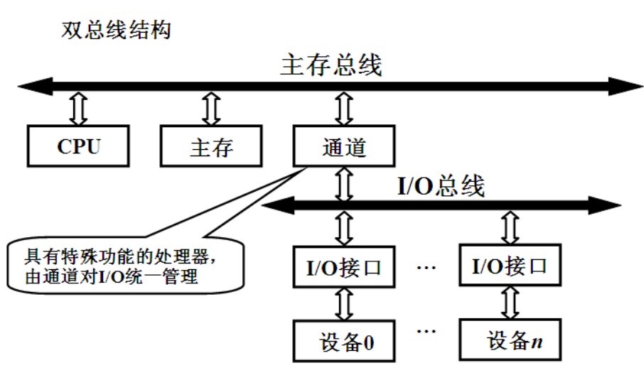 |  |
  | -------------------- | -------------------- |
  | 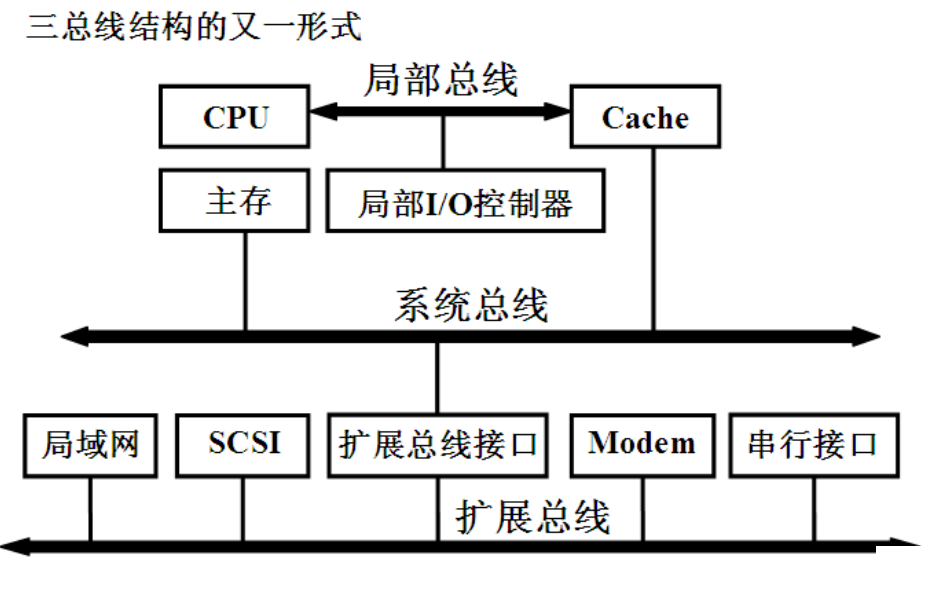 | 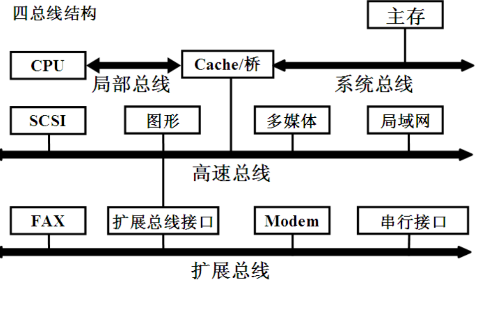 |

* **总线内部结构**

  

  * 四部分组成
    * **数据传送总线**
      * 数据、地址、控制
    * **仲裁总线**
      * 包括总线请求线、总线授权线
    * **中断和同步总线**
    * **公用线**

## 总线仲裁

* **设备的主从状态**

  * 连接到总线的设备有主动和被动的两种形态，主动方对总线有控制功能，可以启动一个总线周期；被动方只能响应主动方的请求。
  * 每次总线操作，只能有一个主动方占用总线控制权，可以同时有多个被动方

* **总线仲裁**

  * **集中式仲裁**

    * 控制逻辑集中在一处，每个设备模块有两条线连到总线仲裁器：一条是送往仲裁器的**总线请求信号BR**，另一条是仲裁器送出的**总线授权信号线BG**

    * 三种集中式仲裁方式：

      * **链式查询方式**

        * **总线授权信号线BG**串行地从一个I/O传送到下一个I/O。

          若BG到达的接口无请求，则继续向下查询

          若BG到达地接口有请求，则不再往下查询，当前接口获得总线使用权，**建立总线忙BS信号**

        * 是一种**优先级仲裁—离总线仲裁器最近的设备具有最高的优先级**

        

      * **计数器定时查询方式**

        * 查询过程：设备要使用总线时，通过BR发出请求。总线仲裁器接到信号后**在总线当前未使用情况下**开始计数，将计数值通过**设备地址线**发给设备。各设备接口将自身的设备地址与计数值比较，一致则获得总线使用权，此时置BS为1并终止计数。
        * 计数可以从0开始，也可从上次终止值开始

        

      * **独立请求查询方式**

        * 每个设备都有一对**总线请求线、总线授权线**。**总线仲裁器有一个排队电路，根据一定的优先次序决定首先响应哪个设备的请求**

        

  * **分布式仲裁**

    * **自举分布式仲裁**：每个设备独立地决定自己是不是最高优先级请求者
    * **冲突检测分布式仲裁**：每个设备独立地请求总线，同时使用总线的设备会发生冲突，冲突被检测到，按照某种策略在冲突的各方选择一个设备
    * **并行竞争分布式仲裁**
      * 每个主设备有专属的**仲裁号和仲裁器**
      * 仲裁过程：当有总线请求时，把唯一的仲裁号发送到共享的仲裁总线上。每个仲裁器将仲裁总线上的号与自己的号进行比较。如果仲裁总线上的号大，则总线请求不予响应，并撤销仲裁号。最后，获胜者的仲裁号留在仲裁总线上

## 总线通信

### 总线操作与总线周期

* **读操作**
  * 由从设备到主设备的数据传送
* **写操作**
  * 由主设备到从设备的数据传送
* **块传送方式**
  * 猝发式传送，只要给出块的起始地址，就可以对固定块长度的数据一个接一个地读出/写入
* **先写后读、先读后写**
  * 前者用于校验，后者用于多道程序系统对共享存储资源的保护
* **广播**
  * 一个主设备对多个从设备的写操作
* **广集**
  * 多个从设备对一个主设备的读操作
* **总线周期**
  * 分为**申请分配阶段、寻址阶段、传送阶段、结束阶段**
* **传送方式**
  * 串行传送
  * 并行传送
  * 总线复用：既传数据又传地址

### 总线通信方式

> 解决**通信双方如何获知传输的开始与结束，以及通信双方如何协调配合**

* **同步通信**

  * 通信双方由统一时钟标准控制数据传送

* **异步通信**

  * 允许各部件速度不一致，采用**应答方式**，在主、从设备间增加两条应答线
  * 异步通信应答方式
    * 不互锁(访存)
    * 半互锁(访问共享存储器)
    * 全互锁(网络通信)

  

  
  * 异步串行通信字符格式中包含**起始位、终止位、校验位**等附加位

    * 比特率：单位时间内传送的二进制有效数据的位数
    * 波特率：单位时间内传送的二进制数据的位数
    * `e.g.`

    

* **半同步通信**

  * 保留同步通信的基本特点(所有地址、命令、数据信号的发出，都参照系统时钟沿开始)
  * 结合异步通信方式，允许设备部件以不同速度工作(增加一条等待响应信号线)

  

* **分布式通信**
  * 将一个总线周期分为两个子周期
    * 第一个子周期：**主设备**获得总线使用权后向有关设备发出地址、命令等信息，然后放弃总线使用权
    * 第二个子周期：**从设备**准备好数据，申请总线使用权，向相应的主设备发送要求的数据
  * 特点
    * 每个设备都成了**主设备**
    * 采用**同步方式通信**，不等对方回答
    * 各模块准备数据时，**不占用总线**

# CH8(I/O系统)

## I/O信息交换方式

* 共有四种方式：**程序查询方式、程序中断方式、DMA方式、通道方式**

  * **程序查询方式**

    * 数据在CPU与外设之间的传送靠计算机程序控制。是在CPU的主动控制下进行，有I/O操作时，CPU暂停主程序，转去执行设备I/O的服务程序

    

    

  * **程序中断方式**

    * CPU暂时中止现行程序，转去处理随机发生的紧急事件，处理完后自动返回原程序

  * **DMA方式**

    * 直接内存访问，基本思想是**硬件DMA控制器从CPU完全接管对总线的控制，数据交换不经过CPU，直接在I/O和主存之间进行**

    

    * DMA基本操作

      * 从外设发出DMA请求
      * CPU响应请求，DMA控制器接管总线控制
      * DMA控制器对内存寻址，决定数据传送的内存单元地址、数据传送的个数，并执行数据传送操作
      * 向CPU报告DMA操作结束

    * **DMA与主存交换数据的方式**

      * **停止CPU访问内存**

      

      * **周期窃取**
        
        * DMA控制器与主存之间传送一个数据时，占用一个/多个CPU周期(即**CPU暂停工作一个周期，然后继续执行程序**)
        
        * **I/O通过DMA访问主存**可能出现的情况：
          * CPU此时不访存，无冲突
          * CPU此时正在访存，访问结束后让出总线
          * CPU和DMA同时访存，**DMA优先**
        
        
        
      * **DMA与CPU交替访存**
      
        * CPU周期被分成两部分：一部分用于CPU访存，另一部分用于DMA访存
      
        
      
    * **DMA控制器的基本组成**
    
      * **内存地址寄存器(AR)**：用于存放内存中要交换的数据的地址。DMA传送时，每交换一次数据，寄存器值加一
      * **字计数器(WC)**：用于记录传送数据块长度
      * **数据缓冲寄存器(BR)**：用于暂存每次传送的数据
      * **设备地址寄存器(DAR)**：IO设备码或者辅存寻址信息
      * **控制/状态逻辑**
    
      
    
    * **DMA数据传送过程**
    
      * **预处理**
    
        * 通知DMA控制器传送方向；设备地址写入DAR；主存地址写入AR；传送字数写入WC
    
      * **数据传送**
    
        * 以数据块为单位，通过循环实现
    
        
    
      * **后处理**
    
        * 校验送入主存的数据是否正确，是否继续用DMA
    
      |     输入数据过程     |     输出数据过程     |
      | :------------------: | :------------------: |
      |  | 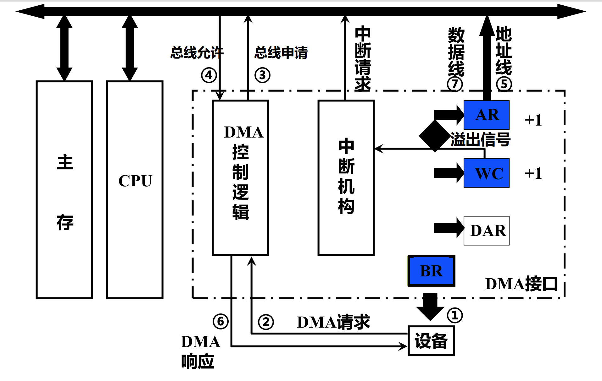 |
  
  * **前三种方式的比较图**
  
    
  
  * **通道方式**
    * 通道：计算机系统中代替CPU管理控制外设的独立部件，是一种能执行有限I/O指令集合(**通道命令**)的IO部件
      * 通道的功能包括：**执行通道指令、组织外设和内存进行数据传输、按IO指令要求启动外设、向CPU报告中断**
    * 一个主机可以连多个通道，一个通道可以连多个IO设备

## 辅助存储器

### 磁记录设备

* **设备读写方式**

  * 随机方式：如RAM
  * 顺序方式：如磁带
  * 直接方式：如磁盘

* **技术指标**

  * **记录密度**

    * **道密度**：沿半径方向单位长度的**磁道数**，单位$道/英寸$。$D_t=\frac{1}{P}$，其中$P$是道距

    * **位密度**：单位长度磁道所记录的**数据位数**，单位$位/英寸$。$D_b=\frac{f_t}{\pi\times d_{min}}$，其中$f_t$是每道的总位数，$d_{min}$是同心圆的最小直径

  * **容量**

    * **磁盘总容量**：$C=n\times k\times s$，其中$n$是**盘面数**，$k$是**每面磁道数**，$s$是**每道记录代码数**

  * **寻址时间**

    * 磁盘寻址过程为**直接存取**时

      * **寻址时间=寻道时间($t_s$)+等待时间($t_w$)**

      * **平均寻址时间**：$T_a=t_{sa}+t_{wa}=\frac{t_{smax}+t_{smin}}{2}+\frac{t_{wmax}+t_{wmin}}{2}$

    * 磁盘寻址过程位**顺序存取**时

      * **寻址时间=空转时间**

  * **传输率、误码率**

    * **传输率**：单位时间传输的数据量。$D_r=D(记录密度)\times V(介质运行时间)$

    * **误码率**：$\frac{出错位数}{读出的总位数}$

  * `e.g.`

  

* **磁记录方式(编码方式)**

  * **归零制(NZ)**

    * 正脉冲电流表示“1”，负脉冲电流表示“0”。在记录下一个信息前，**记录电流恢复为零**

    * **有自同步能力(能从磁头读出信号中分离获得同步信号)**

    

  * **不归零制(NRZ)**

    * 电流方向“见变就翻”，对连续的“1”、“0”，写电流方向不变
    * **无自同步能力**

    

  * **见“1”就翻的不归零制(NRZ1)**

    * 在记录“1”时，电流改变方向，写“0”电流保持不变
    * **无自同步能力**

    

  * **调相制(PM)**

    * 记录“0”时，翻转方向由负变为正；记录“1”时，翻转方向由正变为负
    * **有自同步能力**

    

  * **调频制(FM)**

    * 频率变化(“1”的频率是“0”的两倍)，在位与位之间的边界处都要翻转一次
    * **有自同步能力**

    

  * **改进调频制(MFM)**

    * 不是每个位周期起始处都翻转，连续两个/两个以上的“0”时，位周期起始处翻转一次
    * **有自同步能力**

    

  * 上述方式的对比

  

